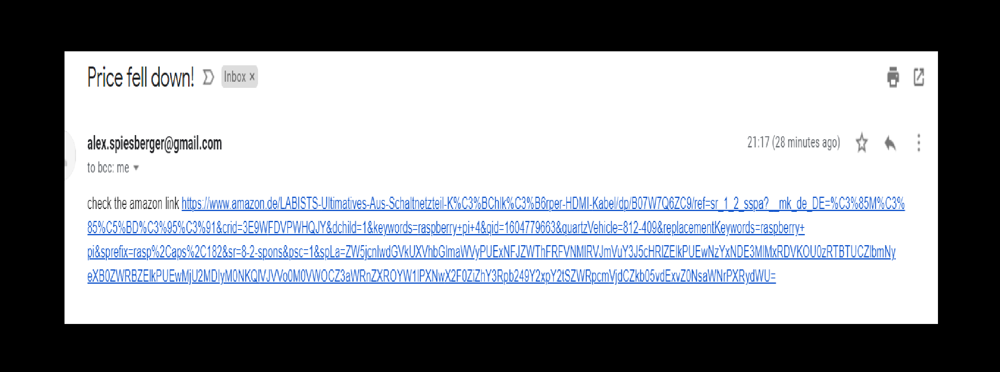
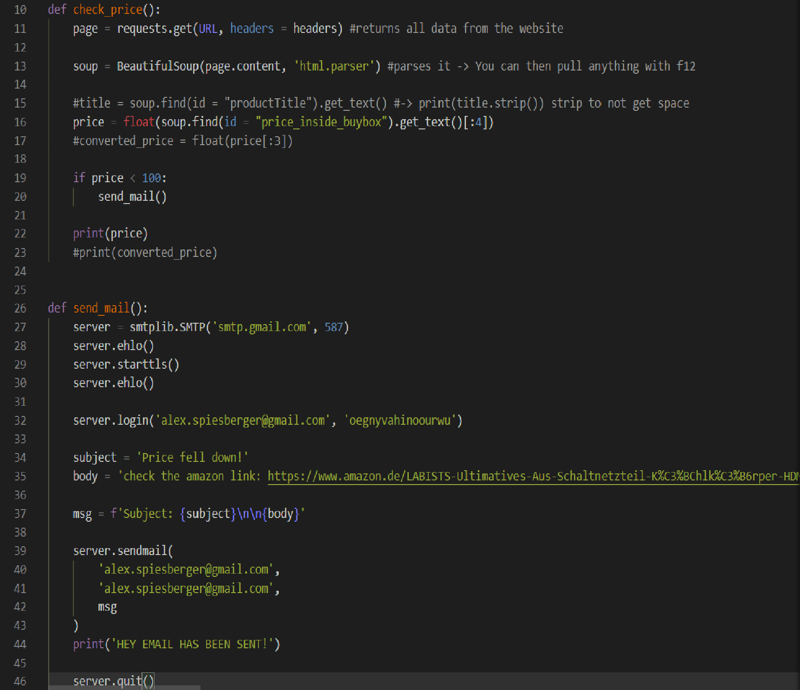

# Amazon_scraper

- Repository: `Python`
- Type of challenge:  `Learning`
- challenge :  `Saturday night challenge`
- [Inspired from this video](https://www.youtube.com/watch?v=Bg9r_yLk7VY&ab_channel=DevEd)

## My Project
This is a very small project to learn the different possibilities of python. These are just 2 main functions and a bit of code to send an Email whenever the "Raspberry pi starter Kit" is under 100 euros.
It tests every 2 days and sleeps between.

## My Email

## The 2 main functions

